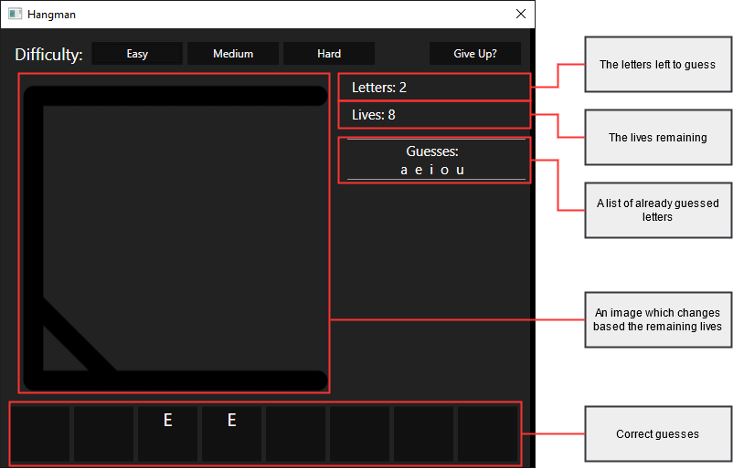
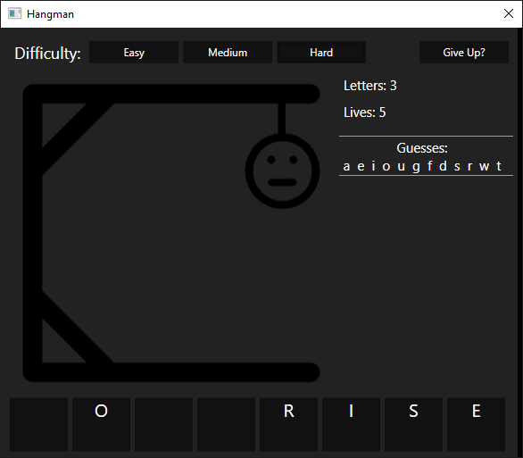
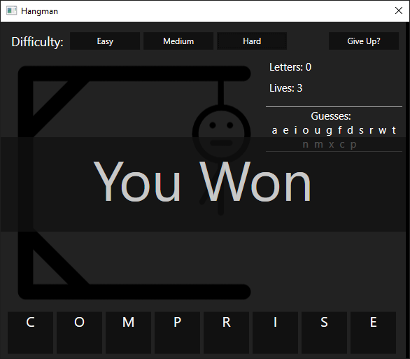
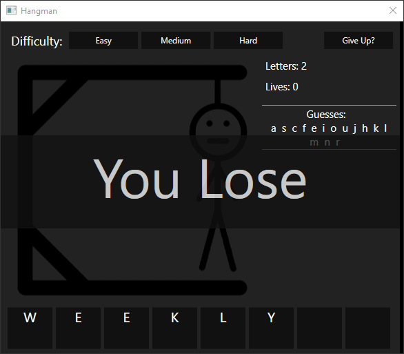
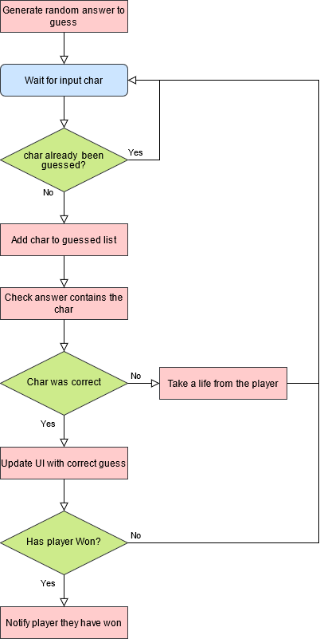
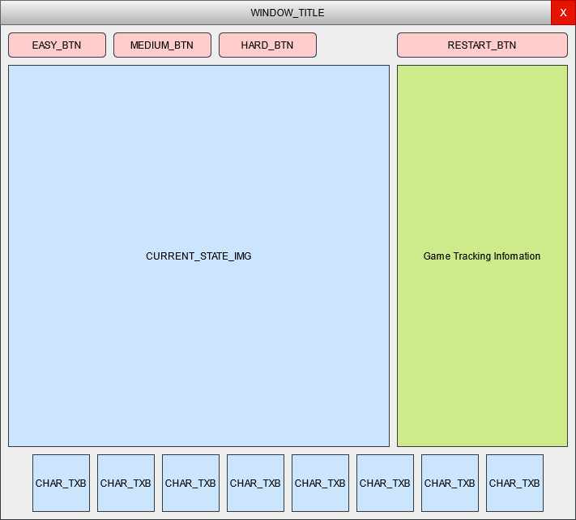
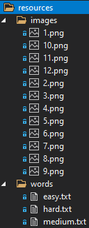

# hangman
A game of Hangman in a WPF application utilising embedded resources.

## Content
 - [How To Run?](#How-To-Run?)
   - [Requirements](#Requirements)
   - [Development Tools](#Development-Tools)
   - [How to Play](#How-to-Play)
 - [Showcase Screenshots](#Showcase-Screenshots)
 - [Design](#Design)
   - [Flow-Chart Concept](#Flow-Chart-Concept)
   - [UI](#UI)
   - [Embedded Resources](#Embedded-Resources)
  
## How to Run
A sample `hangman.exe` file can be found in the `sample` directory.
  
**Note:** if you wish to compile your own .exe file then please use the [Development Tools](#Development-Tools)
  
### Requirements
Any of the following:
 * Windows 7 SP1+
 * Windows 8.1
 * Windows 10
  
### Development Tools
 * Visual Studio 2019
 * .NET Core 3.0
  
### How to Play
Before accepting input the user must select a difficulty:
| Difficulty | Letters |
| :-:		 | :-:	   |
| Easy		 | 4	   |
| Medium	 | 6	   |
| Hard	     | 8	   |
  
 * Once selected the user can input characters using their keyboard (KeyEventHandler)  
 * Already guessed letters cannot be re-entered
 * To begin a new game simply reselect the difficulty to generate a new word
 * The "Give Up" button will reveal the correct word and notify the player they lost
  
**Game Stats**

  
## Showcase Screenshots
  
**Mid-Game**  

  
**Player Won**  

  
**Player Lost**  

  
## Design
  
### Flow-Chart Concept

  
### UI
A game of hangman will need the following UI elements:
 * Buttons to set the difficulty
 * A restart button
 * An image to display the current state of the game
 * A segment for the player to track certain aspects about the game
 * A row of text blocks to show each correctly guessed letter
  
**UI Design:**  

  
### Embedded Resources
The resources are contained within `hangman.dll`  
`LoadResources.cs` is a static utility class used to load the embedded resources by getting the executing assembly  
  
Here is the file structure for the resources within the project:  

